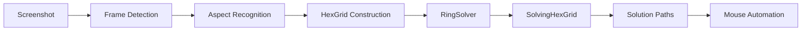

## Overview

The Thaumcraft 4 Research Bot automates solving the Thaumcraft 4 research minigame through a four-stage pipeline:

<Steps>
  <Step title="Screenshot Capture">
    The bot captures the research puzzle from your Minecraft screen
  </Step>
  <Step title="Puzzle Recognition">
    Pixel-based analysis identifies aspects, connections, and the grid structure
  </Step>
  <Step title="Pathfinding & Solving">
    The RingSolver algorithm finds optimal aspect paths to connect all nodes
  </Step>
  <Step title="Solution Execution">
    Mouse movements are automated to execute the solution in-game
  </Step>
</Steps>

## The Complete Workflow

### 1. Screenshot Capture

The bot starts by taking a screenshot of your Minecraft window, capturing the research table interface. This image contains all the visual information needed to reconstruct the puzzle state.

### 2. Puzzle Recognition

The recognition phase uses pixel-perfect color matching to identify:

- **Frame Detection**: Locates the puzzle boundary using specific RGB colors
- **Aspect Recognition**: Identifies each aspect by its unique color signature
- **Grid Construction**: Maps aspects to hexagonal grid coordinates
- **Connection Points**: Finds available spaces and existing connections

See [Puzzle Recognition](/concepts/puzzle-recognition) for technical details.

### 3. Solving Algorithm

The RingSolver performs an intelligent depth-first search to connect all aspects:

```python
# Simplified solver loop from ringsolver.py
while not done:
    # Find unconnected nodes
    unconnected = solving.get_unconnected_filled_positions(target)
    
    if len(unconnected) == 0:
        # Found a complete solution!
        report_solution()
    else:
        # Find paths to connect nodes
        paths = solving.pathfind_both_to_many(target, unconnected)
        # Apply best path and continue
```

The solver considers:
- **Aspect costs**: Primal aspects (aer, terra, etc.) cost 1, compound aspects cost more
- **Path length**: Shorter paths on the board are preferred
- **Connection topology**: Ensures all nodes form a connected graph

See [Solver Algorithm](/concepts/solver-algorithm) for implementation details.

### 4. Solution Execution

Once the optimal solution is found, the bot:

1. Converts grid coordinates to screen pixel locations
2. Generates mouse movement sequences
3. Executes click-and-drag actions to place aspects
4. Verifies the solution is complete

## Key Design Principles

<CardGroup cols={2}>
  <Card title="Pixel-Perfect" icon="crosshairs">
    Uses exact RGB color matching for reliable aspect detection across different GUI scales
  </Card>
  <Card title="Graph-Based" icon="diagram-project">
    Models the puzzle as a hexagonal grid graph with aspect transformation rules
  </Card>
  <Card title="Cost-Optimized" icon="coins">
    Minimizes total aspect cost by preferring cheaper transformation paths
  </Card>
  <Card title="Backtracking Search" icon="arrows-split-up-and-left">
    Explores multiple solutions to find the global optimum
  </Card>
</CardGroup>

## Performance Characteristics

<Note>
  The solver typically finds solutions in under a second for most puzzles. Complex puzzles with many nodes may take a few seconds as the solver explores the search space.
</Note>

**Optimization Strategies:**

- **Caching**: Grid state and pathfinding results are cached to avoid redundant computation
- **Pruning**: Paths that exceed the current best cost are abandoned early
- **Heuristics**: Aspects are sorted by cost to explore cheaper paths first

## Data Flow



## Next Steps

<CardGroup cols={2}>
  <Card title="Puzzle Recognition" icon="eye" href="/concepts/puzzle-recognition">
    Learn how pixel-based recognition works
  </Card>
  <Card title="Solver Algorithm" icon="microchip" href="/concepts/solver-algorithm">
    Deep dive into the RingSolver implementation
  </Card>
  <Card title="Aspect System" icon="atom" href="/concepts/aspect-system">
    Understand aspect costs and transformations
  </Card>
</CardGroup>